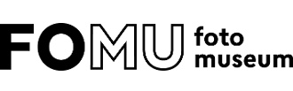

Opdracht
--------

Je werkt in groep één project uit dat bestaat uit verschillende deelopdrachten. De resultaten van de deelopdrachten kunnen deliverables zijn en/of een onderdelen van het productiedossier.   Een museum wil de bezoeker een nieuwe gebruikersbeleving (Eng.: User Experience) geven door gebruik te maken van smartwatch en smartphone.

- Stel een groep samen van maximaal 2 studenten.
- Kies met je groep een bestaand museum dat je ook echt gaat bezoeken.
- Voer de deelopdrachten uit.

Teamleden
---------

 - Celine Tettelin
 - Geertje van der Linden

Gekozen Museum
--------------
FOMU - Foto museum in Antwerpen

Wij kozen voor het foto museum in Antwerpen (afgekort FOMU). Fotografie is iets dat ons enorm interesseert. Daarnaast is het een museum met een groot aanbod en een redelijk vast publiek. Hierdoor leek het ons boeiend om hier een app voor te ontwerpen. 

