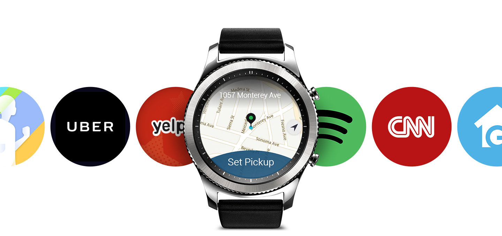
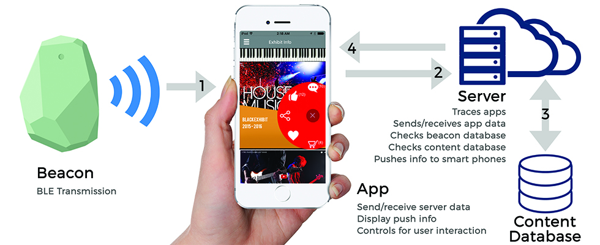

## Smartwatch - Samsung Gear S3 Classic

Net als zijn voorganger brengt de Samsung Gear S3 diverse vernieuwingen met zich mee.

- 1,3 inch-scherm met 360 bij 360 pixels
- 1GHz dualcore-processor met 768MB RAM
- 4GB aan intern geheugen, 380 mAh-accu
- Kan draadloos worden opgeladen

Pluspunten                        | Minpunten             |
----------------------------------|-----------------------|
Fraai design                      | Draait op Tizen       |
Verschillende versies beschikbaar | Relatief klein scherm |
Stof- en waterbestendig           |                       | 
==================================|=======================|
{:.table}

## Smartphone - OnePlus 5T

De OnePlus 5T werd op 16 november 2017 aangekondigd en is een licht verbeterde versie van de OnePlus 5. Toch zijn er een aantal interessante vernieuwingen aanwezig.

 - 6 inch-scherm met 2160 bij 1080 pixels
 - Dubbele camera (16 + 20 megapixel) achterop, 16 megapixel-frontcamera
 - Krachtige Snapdragon 835-chip met 6/8GB RAM
 - Keuze tussen 64 of 128GB opslagruimte
 - Vingerafdrukscanner op de achterkant
 - Draait op Android 7.1.1 (Nougat) met OxygenOS

Pluspunten                       | Minpunten                           |
---------------------------------|-------------------------------------|
Prima prijs-kwaliteitverhouding  | Camera's nauwelijks verbeterd       |
De beste mobiele hardware        | Niet waterdicht                     |
Mooi en scherp 6 inch-scherm     | Ondersteunt geen draadloos opladen  | 
=================================|=====================================|
{:.table}

## Besturingssysteem

Wij hebben gekozen om te werken met het besturingssysteem Android.

## Beacon

Wij hebben gekozen om te werken met Beacons voor binnen het museum te gebruiken. Het is een nauwkeurige locatiebepaling, onafhankelijk van het internet.

