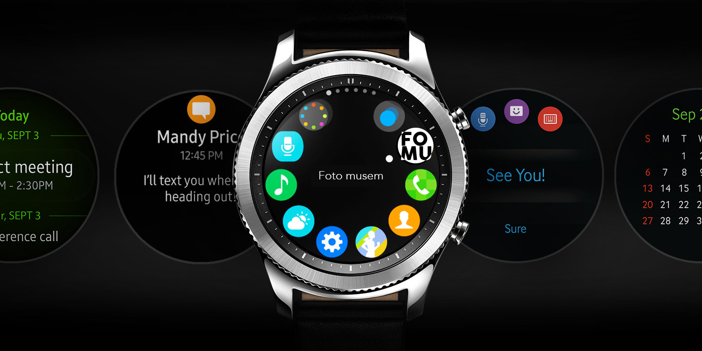
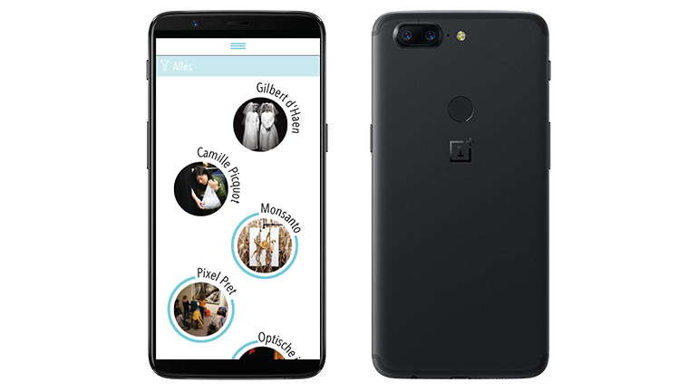

## Algemeen

Met ons concept willen wij de vaste bezoekers van het FOMU Foto museum in Antwerpen een app aanbieden waarvan ze op de smartphone een tijdlijn kunnen zien van hun bezoekjes in het museum en samen met de smartwatch app waar ze tijdens hun bezoek in het FOMU naar de tentoonstellingen kunnen luisteren naar extra informatie dankzij Beacons en je kan je favoriete tentoonstellingen en/of workshops liken.

## Smartphone features

De Smartphone app zal geconnecteerd zijn met de Smartwatch nadat je het museum bezocht hebt, de app zal al jouw informatie bevatten van tijdens je bezoek aan het FOMU Foto museum.

De app toont je jouw gepersonaliseerde tijdlijn, waar al jouw bezochte, gelikte en voorgestelde tentoonstellingen en workshops. 

Deze handige app zal het je makkelijker maken om al jouw informatie van jouw museum bezoekjes bij te houden, ook zal je op de app kunnen zien wanneer de huidige tentoonstellingen en workshops in het museum te vinden zijn.

## Smartwatch features

De Smartwatch app kan je gebruiken tijdens je bezoek in het FOMU Foto museum in Antwerpen, daar kan je met een smartwatch naar informatie luisteren over de fotograaf, series of achtergrond van de door jouw gekozen artiest.

De app toont jou ook een optie om jouw favoriete fotograaf en/of tentoonstelling te liken en toond jou naar welke tentoonstellingen en workshops je bent geweest.

Het handige aan het gebruik van een Smartwatch in het museum is dat je niet zal gestoord worden tijdens je bezoek door andere notifications of berichtjes van op jouw Smartphone.

